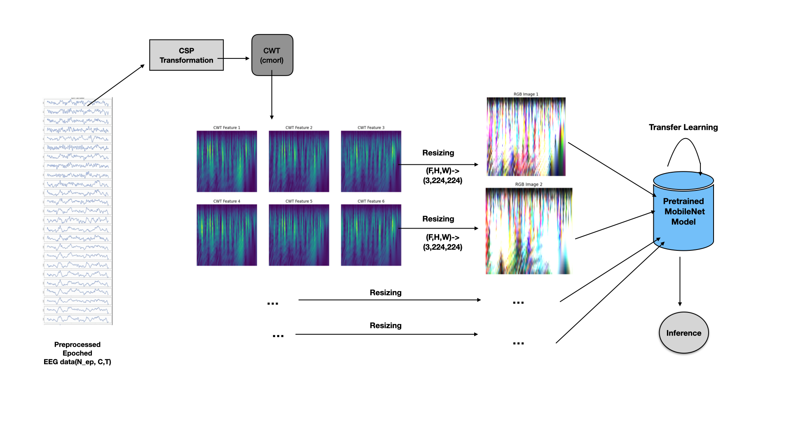

# Feature Extraction and classification of EEG data based on Motor Imagery using Meta heuristic optimisation techniques and novel Deep learning methods

## BCI_EEG_ML-classification-models
 ConvNETs based ML models for feature extracted 64 channel EEG data

## Abstract:

Brain-computer interface (BCI) is an integrated system that allows people to communicate  and control external devices simply by extracting useful information from the brain signals. Motor imagery classification is an important topic in BCI research that enables the classification of a subject's motor movements thereby facilitating the use of information to implement prosthesis control. The brain dynamics of motor imagery are usually measured by electroencephalography (EEG) as a low signal-to-noise ratio non-stationary time series data. In this project we  present a novel deep learning scheme based on multi-branch 2D convolutional neural network (CNN) that utilises different hyper parameter values for each branch and is more flexible to data from different subjects. Specifically, frequency domain representations of EEG signals processed via fast Fourier transform (FFT) and then feature extracted using optimization techniques is used to train the CNN architecture. These fusion ConvNets are then stacked up with an extra output layer to form a nonlinear multi-layer neural network. The output layer then employs the softmax regression to accomplish the classification task. Also, the conjugate gradient method and back-propagation are used to fine tune the EEGNet along with a more robust off line preprocessing pipeline has been devised to sample the interference and artefact noises and present a more clean EEG data for training the model.The EEG signals are recorded from 64 channels for 109 subjects, while the subject is performing three different MI tasks.

## Model Architecture:
1. Importing the evoked MI-EEG data(64 channels, 109 subjects, 160 Hz Fs, 4-sec time window, 4 MI tasks, used the BCI competition IV dataset because of standard reasons )
2. Preprocessing the high SNR data(nonlinear noise filtering(multiscale principle component analysis (MSPCA)), artefact removal using ICA data extraction, event logging using existing labels)
3. Optimum channel selection(*the use of the sparse common spatial pattern (SCSP) for channel selection is still in progress*)
4. Feature Extraction: Mostly planned on using frequency domain extraction techniques :  discriminative Filter bank CSP (DFB CSB) algorithm
5. Feature selection(most preferably using metaheuristic optimization algorithms such as PSO, binary coded GA, or differential evolution)
6. Deep learning Model Training for classification(Coded several simple DL models such as LSTM-based RNNs, Shallow ConvNets, and EEGNet fusion but I am finally planning on using Deep belief networks based on restricted Boltzmann machines for final training because of its nonlinear structure and best accuracy)
7. Validation tests and hyperparameter tuning(tune the learning rate, optimizers, and other model hyperparameters for better accuracy in classification.

## Dependencies Required
* Python 3.7
* Tensorflow 2.1.0
* MATLAB 9.10.0
* SciKit-learn 0.22.1
* SciPy 1.4.1
* Numpy 1.18.1
